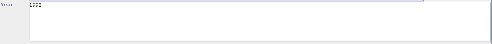

# Projeto - Entrega Final

Link para o vídeo de apresentação: https://drive.google.com/file/d/1xflGr16gFOXJ_c8EqaECpAKUpvsCMGvj/view?usp=sharing

## 1. Grupo

- Guilherme Locca Salomão - 758569

## 2. Especificações

Para este projeto, foram requisitadas as seguintes etapas:

- Criação do repositório remoto no github
- Testes funcionais e Relatórios de cobertura sobre as seguintes funções:
	- Função de Adicionar Artigos e Livros
	- Importar item bibliográfico a database via arquivos
- Manutenção Perfectiva
	- Validação de campos na adição de Artigos e Livros
	- Permitir a importação via formato .CSV
- Testes adicionais exercitando novas funcionalidades

Observação: pelo uso de um editor de <em>Markdown</em> não foi possível a numeração de páginas
## 3. Repositório GitHub

Para esta tarefa, foi criado um repositório remoto git no github.

[https://github.com/Caotichazard/DC-UFSCar-ES2-202101-ENPE-3-NewJabRef](https://github.com/Caotichazard/DC-UFSCar-ES2-202101-ENPE-3-NewJabRef)

Nele foram criadas os dois *issues* a serem resolvidos com as manutenções perfectivas
- [iss01](https://github.com/Caotichazard/DC-UFSCar-ES2-202101-ENPE-3-NewJabRef/issues/1): Adição da funcionalidade de verificação de Ano e *BibTexKey*
- [iss02](https://github.com/Caotichazard/DC-UFSCar-ES2-202101-ENPE-3-NewJabRef/issues/2): Adição da funcionalidade de importação de entradas através de arquivos CSV

Para a realização, foram criados 2 *branches* novos, um para cada alteração e trabalhados sobre eles as alterações para as funções requisitadas. Após finalizada cada funcionalidade, foi solicitado o *pull request* e seguido pelo *merge* das funcionalidades novas.

 \pagebreak 

## 4. Testes Funcionais e Relatórios de cobertura

Para essa primeira etapa, foi primeiramente realizado uma análise básica de cada funcionalidade, após isso, em conjunto a uma leitura rápida da documentação referente a função, foram definidos os testes que então são realizados manualmente com a execução auxiliada pelo *EclEmma* para a geração dos relatórios de cobertura.

### 4.1 Adição de Artigos e Livros

#### 4.1.2 Função
Essa função possui 5 categorias de entradas diferentes:
- Entradas Obrigatórias
- Entradas Opcionais
- Entradas Gerais
- Entrada de Resumo
- Entrada de Revisão

Destas 5 categorias, apenas as Entradas Obrigatórias são obrigatórias a serem preenchidas para a adição de um Artigo ou Livro a base de dados.

Para a adição de um Artigo, os seguintes campos são obrigatórios:
- *Author*
- *Title*
- *Journal*
- *Year*
- *BibTexKey*

e para adicionar um Livro:
- *Title*
- *Publisher*
- *Year*
- *Author*
- *Editor*
- *BibTexKey*

Fazendo então uma leitura rápida da [documentação](https://docs.jabref.org/v/v4/general/entryeditor#field-consistency-checking) referente a essa funcionalidade, podemos observar que:
- Todos os campos são campos de texto.
- Há apenas uma categoria de entrada invalida, o símbolo #, permitido apenas o uso dele em pares.
- Caso haja algum erro no campo inserido, ele deve se tornar vermelho indicando a presença de um erro.
- Caso haja um erro, alterações não serão armazenadas.

Durante os testes elaborados, é esperado receber uma das seguintes indicações de erro ou sucesso:

Uma entrada processada com sucesso

Uma entrada processada com erro

#### 4.1.3 Testes

##### 4.1.3.1 Adicionar Artigo

Para a funcionalidade de adicionar um Artigo, foram realizados os seguintes testes

Utilizando o particionamento de equivalência, podemos dividir nossas entradas em 3 tipos:
- um campo vazio (indicado por -)
- um campo com uma entrada invalida (neste caso foi usado o caracter # indicado como invalido na documentação)
- um campo com entrada válida

e as saídas em 2 classes:
- Erro em um campo
- Entrada adicionada

ID |Author | Title | Journal | Year | Bibtexkey | Saida esperada
- |-|-|-|-|-|-
1 |-|-|-|-|-|todos campos em vermelho, indicando erro
2|author|-|-|-|-|todos os campos, exceto author, em vermelho, indicando erro
3|-|title|-|-|-|todos os campos, exceto title, em vermelho, indicando erro
4|-|-|journal|-|-|todos os campos, exceto author, em vermelho, indicando erro
5|-|-|-|year|-|todos os campos, exceto author, em vermelho, indicando erro
6|-|-|-|-|Bibtexkey|todos os campos, exceto author, em vermelho, indicando erro
7|-|title|journal|year|Bibtexkey|Apenas o campo author em vermelho, indicando erro
8|author|-|journal|year|Bibtexkey|Apenas o campo title em vermelho, indicando erro
9|author|title|-|year|Bibtexkey|Apenas o campo journal em vermelho, indicando erro
10|author|title|journal|-|Bibtexkey|Apenas o campo year em vermelho, indicando erro
11|author|title|journal|year|-|Apenas o campo author em bibtexkey, indicando erro
12|#|title|journal|year|Bibtexkey|Apenas o campo author em vermelho, indicando erro
13|author|#|journal|year|Bibtexkey|Apenas o campo title em vermelho, indicando erro
14|author|title|#|year|Bibtexkey|Apenas o campo journal em vermelho, indicando erro
15|author|title|journal|#|Bibtexkey|Apenas o campo year em vermelho, indicando erro
16|author|title|journal|year|#|Apenas o campo author em bibtexkey, indicando erro
17|author|title|journal|year|bibtexkey|Entrada adicionada a base de dados

##### 4.1.3.2 Adicionar Livro
Para a funcionalidade de adicionar um Livro, foram realizados os seguintes testes

Utilizando o particionamento de equivalência, podemos dividir nossas entradas em 3 tipos:
- um campo vazio (indicado por -)
- um campo com uma entrada invalida (neste caso foi usado o caracter # indicado como invalido na documentação)
- um campo com entrada válida

e as saídas em 2 classes:
- Erro em um campo
- Entrada adicionada

ID |Title | Publisher | Year | Author | Editor | Bibtexkey | Saida esperada
 -| -|-|-|-|-|-|-
1|-|-|-|-|-|-|todos campos em vermelho, indicando erro
2|title|-|-|-|-|-|todos os campos, exceto title, em vermelho, indicando erro
3|-|publisher|-|-|-|-|todos os campos, exceto publisher, em vermelho, indicando erro
4|-|-|year|-|-|-|todos os campos, exceto year, em vermelho, indicando erro
5|-|-|-|author|-|-|todos os campos, exceto author, em vermelho, indicando erro
6|-|-|-|-|editor|-|todos os campos, exceto editor, em vermelho, indicando erro
7|-|-|-|-|-|bibtexkey|todos os campos, exceto bibtexkey, em vermelho, indicando erro
8|-|publisher|year|author|editor|bibtexkey|Apenas o campo title em vermelho, indicando erro
9|title|-|year|author|editor|bibtexkey|Apenas o campo publisher em vermelho, indicando erro
10|title|publisher|-|author|editor|bibtexkey|Apenas o campo year em vermelho, indicando erro
11|title|publisher|year|-|editor|bibtexkey|Apenas o campo author em vermelho, indicando erro
12|title|publisher|year|author|-|bibtexkey|Apenas o campo editor em vermelho, indicando erro
13|title|publisher|year|author|editor|-|Apenas o campo bibtexkey em vermelho, indicando erro
14|#|publisher|year|author|editor|bibtexkey|Apenas o campo title em vermelho, indicando erro
15|title|#|year|author|editor|bibtexkey|Apenas o campo publisher em vermelho, indicando erro
16|title|publisher|#|author|editor|bibtexkey|Apenas o campo year em vermelho, indicando erro
17|title|publisher|year|#|editor|bibtexkey|Apenas o campo author em vermelho, indicando erro
18|title|publisher|year|author|#|bibtexkey|Apenas o campo editor em vermelho, indicando erro
19|title|publisher|year|author|editor|#|Apenas o campo bibtexkey em vermelho, indicando erro
20|title|publisher|year|author|editor|bibtexkey|Entrada adicionada a base de dados

#### 4.1.4 Comentários

Durante os testes, foi notado que:

Para casos onde havia campos incompletos ou errados, não havia uma janela de *pop-up* para avisar erro, exceto no caso de um erro na definição do campo *BibTexKey*, o qual não aceita o símbolo #. Quando esse simbolo era digitado em algum campo, se nele não era aceito, nada ocorria.

Além disso, os campos *Title* e *Year* para adicionar Artigo aceitavam o símbolo #. Porem, o campo *Title* não aceitava # na função de adicionar um Livro

Outro detalhe foi que, após fechar e abrir novamente o programa, havia uma única janela de aviso, notificando o usuário dos erros presentes nas entradas.

Os relatórios de cobertura gerados, foram gerados no formato HTML.

 1 

### 4.2 Importação de itens bibliográficos na base corrente

#### 4.2.1 Função

Para a funcionalidade de importação de itens, o programa nos da opção de importar baseado nos seguintes formatos de arquivos:
- BibTeX         : bibtex
- BibTeXML       : bibtexml
- Biblioscape    : biblioscape
- Copac          : cpc
- INSPEC         : inspec
- ISI            : isi
- MSBib          : msbib
- Medline        : medline
- MedlinePlain   : medlineplain
- Ovid           : ovid
- PDFcontent     : pdfcontent
- REPEC New Economic Papers (NEP) : repecnep
- RIS            : ris
- Refer/Endnote  : refer
- SilverPlatter  : silverplatter
- XMP-annotated PDF : xmpannotatedpdf
- text citations : textcitations

Por recomendação, será usado apenas o formato *BibTex* (*.bib)

Com esse arquivo, o programa deve então processar e adicionar a base de dados atual as informações presentes no arquivo.

#### 4.2.2 Testes

Durante os testes são esperados encontrar os seguintes indicadores de erro ou sucesso:

Uma entrada processada com erro

Uma entrada processada com sucesso

Para os testes dessa funcionalidade, utilizando o particionamente de equilvalência, separamos a entradas em 3 classes:
- tipo do arquivo
- Tipo de importação
- Tipos de erros

e para as as saidas, foram definidas duas classes:
- Importação falhou
- Importação com sucesso

e Utilizando a analise de valor limite, foi definido o uso apenas do arquivo do tipo \*.bib para testar os tipos de importação.

ID | Tipo do arquivo | Tipo de importação | Erros no arquivo | Saida esperada
- |- |- |- |-
1 |\*.bib | Automatica | Nenhum | Importação com sucesso
2 |\*.bib | BibTeX | Nenhum | Importação com sucesso
3 |\*.bib | BibTeXML | Nenhum | Falha na importação
4 |\*.bib | Biblioscape | Nenhum | Falha na importação
5 |\*.bib | Copac | Nenhum | Falha na importação
6 |\*.bib | INSPEC | Nenhum | Falha na importação
7 |\*.bib | ISI | Nenhum | Falha na importação
8 |\*.bib | MSBib | Nenhum | Falha na importação
9 |\*.bib | Medline | Nenhum | Falha na importação
10 |\*.bib | MedlinePlain | Nenhum | Falha na importação
11 |\*.bib | Ovid | Nenhum | Falha na importação
12 |\*.bib | PDFcontent | Nenhum | Falha na importação
13 |\*.bib | REPEC New Economic Papers (NEP) | Nenhum | Falha na importação
14 |\*.bib | RIS | Nenhum | Falha na importação
15 |\*.bib | Refer/Endnote | Nenhum | Falha na importação
16 |\*.bib | SilverPlatter | Nenhum | Falha na importação
17 |\*.bib | XMP-annotated PDF | Nenhum | Falha na importação
18 |\*.bib | text citations | Nenhum | Falha na importação
19 |\*.bib | Automatica | Faltando campo obrigatorio | Falha na importação
20 |\*.bib | Automatica | Campos obrigatorios em branco | Importação com sucesso
21 |\*.bib | Automatica | Formato errado | Falha na importação
22 |\*.bib | Automatica | Arquivo vazio | Falha na importação

#### 4.2.3 Comentários

Durante os testes foi notado que em casos do arquivo com erro, principalmente faltando um campo ou com o mesmo vazio, ainda ocorria a importação. Já no caso de importar o arquivo com formatação errada, ele ainda tentava encontrar um formato de arquivo compatível e caso fosse haveria sucesso na importação.

O único caso com erro que impediu a importação foi com o arquivo vazio. E como esperado, caso especificado o tipo do arquivo e fornecido um tipo diferente o mesmo não seria importado.

 \pagebreak 

## 5. Manutenções Perfectivas

### 5.1 Validação de campos

#### 5.1.1 Validação de Ano

Para adicionar essa funcionalidade, foi alterado a função *setField* em *[jabref/src/main/java/net/sf/jabref/model/entry/BibEntry.java](https://github.com/Caotichazard/DC-UFSCar-ES2-202101-ENPE-3-NewJabRef/pull/4/commits/813dc205c780eb046981999f6bddd5b8676954c4#diff-0e97bf2bbf98406d4004bf7659ebcfb5d76c10dc8cf6ec830bee8b2a26f30d23 "jabref/src/main/java/net/sf/jabref/model/entry/BibEntry.java")*

Onde a função analisa o valor a ser inserido no campo sendo editado, e caso o valor seja inválido, levanta uma excessão e indica ao usuário o erro reportado através de uma janela *pop-up*.

A validação do ano é feita por comparar o ano inserido com os valores mínimo e máximo do campo *Year* em *java.time.Year*, sendo eles respectivamente, -999999999 e +999999999 (ambos os valores sendo fornecidos pelas constantes *Year.MIN_VALUE* e *Year.MAX_VALUE*).

#### 5.1.2 Validação de *BibTexKey*

Para adicionar essa funcionalidade, foi alterada a função *checkLegalKey* em *[jabref/src/main/java/net/sf/jabref/logic/labelpattern/LabelPatternUtil.java](https://github.com/Caotichazard/DC-UFSCar-ES2-202101-ENPE-3-NewJabRef/pull/4/commits/13d3b1d5866e0d90a3bf8e924aceeeec3caadb20#diff-39080b92b95f4d2637d4f47ab24b159ac9ed98bf71d529271c16554064a715fd "jabref/src/main/java/net/sf/jabref/logic/labelpattern/LabelPatternUtil.java")*

Onde está função já realiza verificação da validade de uma chave *BibTexKey*, então bastava adicionar a funcionalidade de recusar chaves com menos de 2 caracteres e chaves que não possuíam uma letra como seu primeiro caractere.

### 5.2 Importação por CSV

Nesta manutenção foi requisitado a adição da funcionalidade de importar **Artigos** e **Livros** por meio do formato de arquivo CSV

Para atingir isso foram realizadas as seguintes mudanças.

Primeiramente foi criado o arquivo *CsvImporter.java* o qual realiza a lógica de importação

Depois foi alterado o arquivo *ImportFormatReader.java* onde é incluído o construtor do importador de arquivos CSV

Foi optado por realizar a importação por uso de uma *regex (regular expression)* a qual acessa linha por linha do arquivo e obtêm os nomes dos campos e seus valores.

 \pagebreak 

## 6. Testes de regressão e evolução

Após as manutenções, foram realizados testes para exercitar as funcionalidades novas.

### 6.1 Teste da validação de campos
Para realizar os testes em validações de campos, é necessário testar também a inserção dos campos para garantir o funcionamento normal das funções anteriores, e serão adicionados novos testes para exercitar as funcionalidades novas.

Além disso, é esperado encontrar agora duas novas telas de erro:

Erro no campo *Year*

Erro no campo *Year*, ano fora dos limites do calendário em Java

Erro no campo *BibTexKey*

##### 6.1.1 Adicionar Artigo

Para a funcionalidade de adicionar um Artigo, foram realizados os seguintes testes

Utilizando o particionamento de equivalência, podemos dividir nossas entradas em 3 tipos:
- um campo vazio (indicado por -)
- um campo com uma entrada invalida (neste caso foi usado o caracter # indicado como invalido na documentação, o uso de caracteres para o campo *Year*, o qual só aceita números e entradas com menos de 2 caractéres ou o primeiro caracter diferente de uma letra em *BibTexKey*)
- um campo com entrada válida

e as saídas em 2 classes:
- Erro em um campo
- Entrada adicionada

ID |Author | Title | Journal | Year | Bibtexkey | Saida esperada
- |-|-|-|-|-|-
1 |-|-|-|-|-|todos campos em vermelho, indicando erro e um *pop-up* indicando erro no campo *year*
2|author|-|-|-|-|todos os campos, exceto author, em vermelho, indicando erro e um *pop-up* indicando erro no campo *year*
3|-|title|-|-|-|todos os campos, exceto title, em vermelho, indicando erro e um *pop-up* indicando erro no campo *year*
4|-|-|journal|-|-|todos os campos, exceto journal, em vermelho, indicando erro e um *pop-up* indicando erro no campo *year*
5|-|-|-|year|-|todos os campos, em vermelho, indicando erro e um *pop-up* indicando erro no campo *year*
6|-|-|-|-|Bibtexkey|todos os campos, exceto Bibtexkey, em vermelho, indicando erro e um *pop-up* indicando erro no campo *year*
7|-|title|journal|year|Bibtexkey|Apenas o campo author e year em vermelho, indicando erro e um *pop-up* indicando erro no campo *year*
8|author|-|journal|year|Bibtexkey|Apenas o campo title e year em vermelho , indicando erro e um *pop-up* indicando erro no campo *year*
9|author|title|-|year|Bibtexkey|Apenas o campo journal e year em vermelho, indicando erro e um *pop-up* indicando erro no campo *year*
10|author|title|journal|-|Bibtexkey|Apenas o campo year em vermelho, indicando erro e um *pop-up* indicando erro no campo *year*
11|author|title|journal|year|-|Apenas o campo bibtexkey e year em vermelho, indicando erro e um *pop-up* indicando erro no campo *year*
12|#|title|journal|year|Bibtexkey|Apenas o campo author e year em vermelho, indicando erro e um *pop-up* indicando erro no campo *year*
13|author|#|journal|year|Bibtexkey|Apenas o campo title e year em vermelho, indicando erro e um *pop-up* indicando erro no campo *year*
14|author|title|#|year|Bibtexkey|Apenas o campo journal e year em vermelho, indicando erro e um *pop-up* indicando erro no campo *year*
15|author|title|journal|#|Bibtexkey|Apenas o campo year e year em vermelho, indicando erro e um *pop-up* indicando erro no campo *year*
16|author|title|journal|year|#|Apenas o campo BibTexKey e year em vermelho, indicando erro e um *pop-up* indicando erro no campo *year* e um *pop-up* indicando erro no campo *BibTexKey*
17|author|title|journal|9999999991|Bibtexkey|Apenas o campo year em vermelho, indicando erro e um *pop-up* indicando erro no campo *year*
18|author|title|journal|1234567891|Bibtexkey|Apenas o campo year em vermelho, indicando erro e um *pop-up* indicando erro no campo *year*
19|author|title|journal|999999999|Bibtexkey|Entrada adicionada a base de dados
20|author|title|journal|123456789|Bibtexkey|Entrada adicionada a base de dados
21|author|title|journal|123456789|B|Apenas o campo BibTexKey em vermelho, indicando erro e um *pop-up* indicando erro no campo *BibTexKey*
22|author|title|journal|123456789|1Bi|Apenas o campo BibTexKey em vermelho, indicando erro e um *pop-up* indicando erro no campo *BibTexKey*
23|author|title|journal|123456789|Bi|Entrada adicionada a base de dados
24|author|title|journal|123456789|bi|Entrada adicionada a base de dados
25|author|title|journal|1234|Bibtexkey|Entrada adicionada a base de dados

##### 6.1.2 Adicionar Livro
Para a funcionalidade de adicionar um Livro, foram realizados os seguintes testes

Utilizando o particionamento de equivalência, podemos dividir nossas entradas em 3 tipos:
- um campo vazio (indicado por -)
- um campo com uma entrada invalida (neste caso foi usado o caracter # indicado como invalido na documentação, o uso de caracteres para o campo *Year*, o qual só aceita números e entradas com menos de 2 caractéres ou o primeiro caracter diferente de uma letra em *BibTexKey*)
- um campo com entrada válida

e as saídas em 2 classes:
- Erro em um campo
- Entrada adicionada

ID |Title | Publisher | Year | Author | Editor | Bibtexkey | Saida esperada
 -| -|-|-|-|-|-|-
1|-|-|-|-|-|-|todos campos em vermelho, indicando erro e um *pop-up* indicando erro no campo *year*
2|title|-|-|-|-|-|todos os campos, exceto title, em vermelho, indicando erro e um *pop-up* indicando erro no campo *year*
3|-|publisher|-|-|-|-|todos os campos, exceto publisher, em vermelho, indicando erro e um *pop-up* indicando erro no campo *year*
4|-|-|year|-|-|-|todos os campos, em vermelho, indicando erro e um *pop-up* indicando erro no campo *year*
5|-|-|-|author|-|-|todos os campos, exceto author, em vermelho, indicando erro e um *pop-up* indicando erro no campo *year*
6|-|-|-|-|editor|-|todos os campos, exceto editor, em vermelho, indicando erro e um *pop-up* indicando erro no campo *year*
7|-|-|-|-|-|bibtexkey|todos os campos, exceto bibtexkey, em vermelho, indicando erro e um *pop-up* indicando erro no campo *year*
8|-|publisher|year|author|editor|bibtexkey|Apenas o campo title e year em vermelho, indicando erro e um *pop-up* indicando erro no campo *year*
9|title|-|year|author|editor|bibtexkey|Apenas o campo publisher e year em vermelho, indicando erro e um *pop-up* indicando erro no campo *year*
10|title|publisher|-|author|editor|bibtexkey|Apenas o campo year em vermelho, indicando erro e um *pop-up* indicando erro no campo *year*
11|title|publisher|year|-|editor|bibtexkey|Apenas o campo author e year em vermelho, indicando erro e um *pop-up* indicando erro no campo *year*
12|title|publisher|year|author|-|bibtexkey|Apenas o campo editor e year em vermelho, indicando erro e um *pop-up* indicando erro no campo *year*
13|title|publisher|year|author|editor|-|Apenas o campo bibtexkey e year em vermelho, indicando erro e um *pop-up* indicando erro no campo *year*
14|#|publisher|year|author|editor|bibtexkey|Apenas o campo title e year em vermelho, indicando erro e um *pop-up* indicando erro no campo *year*
15|title|#|year|author|editor|bibtexkey|Apenas o campo publisher e year em vermelho, indicando erro e um *pop-up* indicando erro no campo *year*
16|title|publisher|#|author|editor|bibtexkey|Apenas o campo year em vermelho, indicando erro e um *pop-up* indicando erro no campo *year*
17|title|publisher|year|#|editor|bibtexkey|Apenas o campo author e year em vermelho, indicando erro e um *pop-up* indicando erro no campo *year*
18|title|publisher|year|author|#|bibtexkey|Apenas o campo editor e year em vermelho, indicando erro e um *pop-up* indicando erro no campo *year*
19|title|publisher|year|author|editor|#|Apenas o campo bibtexkey e year em vermelho, indicando erro e um *pop-up* indicando erro no campo *year* e um *pop-up* indicando erro no campo *BibTexKey*
20|title|publisher|9999999991|author|editor|bibtexkey|Apenas o campo year em vermelho, indicando erro e um *pop-up* indicando erro no campo *year*
21|title|publisher|1234567891|author|editor|bibtexkey|Apenas o campo year em vermelho, indicando erro e um *pop-up* indicando erro no campo *year*
22|title|publisher|999999999|author|editor|bibtexkey|Entrada adicionada a base de dados
23|title|publisher|123456789|author|editor|bibtexkey|Entrada adicionada a base de dados
24|title|publisher|123456789|author|editor|B|Apenas o campo BibTexKey em vermelho, indicando erro e um *pop-up* indicando erro no campo *BibTexKey*
25|title|publisher|123456789|author|editor|1Bi|Apenas o campo BibTexKey em vermelho, indicando erro e um *pop-up* indicando erro no campo *BibTexKey*
26|title|publisher|123456789|author|editor|Bi|Entrada adicionada a base de dados
27|title|publisher|123456789|author|editor|bi|Entrada adicionada a base de dados
28|title|publisher|1234|author|editor|bibtexkey|Entrada adicionada a base de dados

### 6.2 Teste da importação por CSV

Como nos testes anteriores dessa funcionalidade, utilizando o particionamente de equilvalência, separamos a entradas em 3 classes:
- tipo do arquivo
- Tipo de importação
- Tipos de erros

e para as as saidas, foram definidas duas classes:
- Importação falhou
- Importação com sucesso

e Utilizando a analise de valor limite, foi definido o uso apenas do arquivo do tipo \*.bib para testar os tipos de importação aleḿ de adicionar casos de uso com o arquivo do tipo \*.csv para exercitar a funcionalidade adicionada.

ID | Tipo do arquivo | Tipo de importação | Erros no arquivo | Saida esperada
- |- |- |- |-
1 |\*.bib | Automatica | Nenhum | Importação com sucesso
2 |\*.bib | BibTeX | Nenhum | Importação com sucesso
3 |\*.bib | BibTeXML | Nenhum | Falha na importação
4 |\*.bib | Biblioscape | Nenhum | Falha na importação
5 |\*.bib | Copac | Nenhum | Falha na importação
6 |\*.bib | INSPEC | Nenhum | Falha na importação
7 |\*.bib | ISI | Nenhum | Falha na importação
8 |\*.bib | MSBib | Nenhum | Falha na importação
9 |\*.bib | Medline | Nenhum | Falha na importação
10 |\*.bib | MedlinePlain | Nenhum | Falha na importação
11 |\*.bib | Ovid | Nenhum | Falha na importação
12 |\*.bib | PDFcontent | Nenhum | Falha na importação
13 |\*.bib | REPEC New Economic Papers (NEP) | Nenhum | Falha na importação
14 |\*.bib | RIS | Nenhum | Falha na importação
15 |\*.bib | Refer/Endnote | Nenhum | Falha na importação
16 |\*.bib | SilverPlatter | Nenhum | Falha na importação
17 |\*.bib | XMP-annotated PDF | Nenhum | Falha na importação
18 |\*.bib | text citations | Nenhum | Falha na importação
19 |\*.bib | CSV | Nenhum | Falha na importação
20 |\*.bib | Automatica | Faltando campo obrigatorio | Falha na importação
21 |\*.bib | Automatica | Campos obrigatorios em branco | Importação com sucesso
22 |\*.bib | Automatica | Formato errado | Falha na importação
23 |\*.bib | Automatica | Arquivo vazio | Falha na importação
24 |\*.csv | CSV | Nenhum | Importação com sucesso
25 |\*.csv | CSV | Faltando campo obrigatorio | Falha na importação
26 |\*.csv  | Automatica | Campos obrigatorios em branco | Importação com sucesso
27 |\*.csv | Automatica | Formato errado | Falha na importação
28 |\*.csv | Automatica | Arquivo vazio | Falha na importação
29 |\*.csv | Automatica | Nenhum | Importação com sucesso

